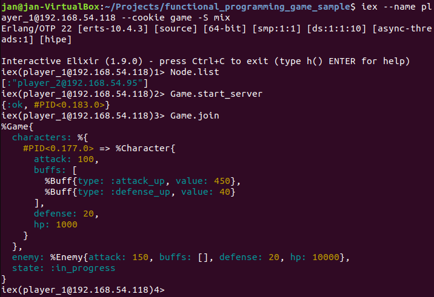
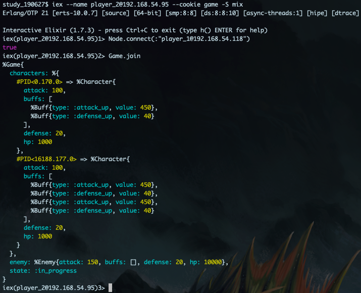
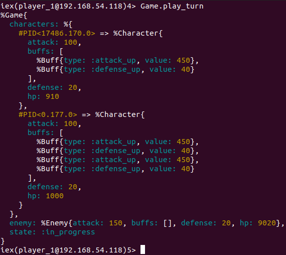
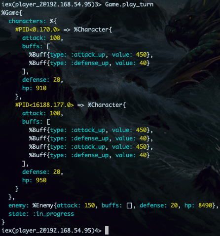
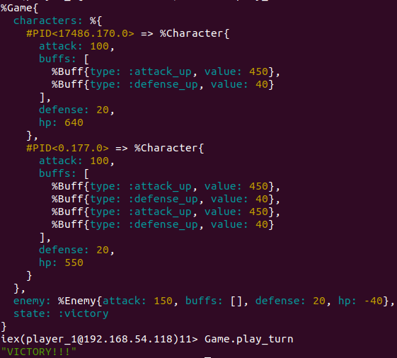
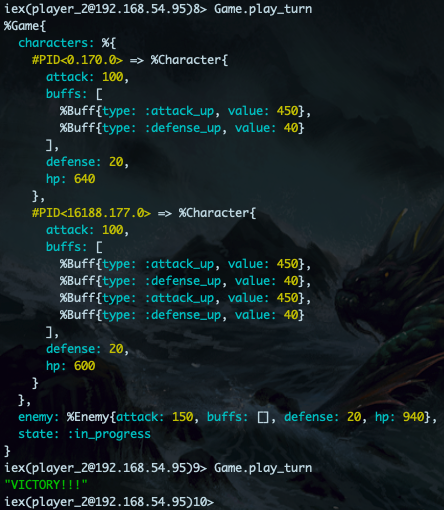

# Functional Programming Game Sample

Example of how to write a simple multiplayer game using a functional programming language such as Elixir.
The code was written to be used in an Elixir study group.
It is intended to show the structure of a functional program, with the game state flowing through the program, making it easy to inspect and see the changes happening after every turn.

A GenServer is used to illustrate how data can be persisted and shared accross multiple nodes.

## Rules

You can play the game through multiple iex sessions. When playing through one window only, you will probably lose!
The rules are simple, you can call ```Game.play_turn()``` to attack the enemy, and the enemy will respond by attacking a random player. If the enemy hp is reduced below 0, you have won. If all players hp are reduced below 0, you have lost. The more players (iex sessions) have joined the game, the stronger every player gets.
In essence, it's all about connecting enough players (hint: 2 is enough) to the game to win.

## Setting up the game

```terminal1
$ iex -S mix --sname player_1
iex(player_1@mycomputername)> Game.start_server()
...> Game.join()
```

```terminal2
$ iex -S mix --sname player_2
iex> Node.connect(:"player_1@mycomputername")
iex> Game.join()
```

## Play

```terminal1
$ iex> Game.play_turn()
```

```terminal2
$ iex> Game.play_turn()
```

## Restart

You might want to restart the game if you have won, lost, or have given up all hope.

```terminal1
$ iex> Game.restart()
```

```terminal2
$ ...> Game.join()
```

## Multiplayer over network

If you want to play the game over a network connection, you will need to specify a shared cookie when starting a session to be able to connect the iex terminals.

```
$ iex -S mix --sname player_1 --cookie mycookie
```

```
$ iex -S mix --sname player_2 --cookie mycookie
iex> Node.connect(:"player_1@mycomputername")
```








